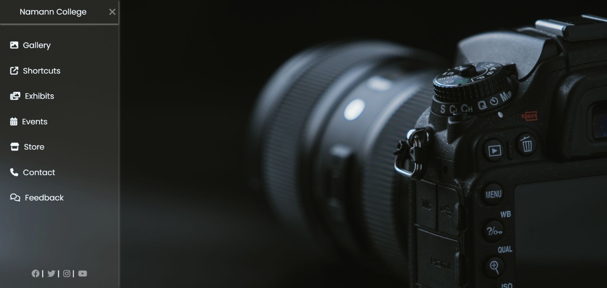

# Sidebar Navigation Menu

This is a simple responsive sidebar navigation menu built using HTML and CSS. It features toggle functionality using a checkbox and is styled with custom fonts and Font Awesome icons. The background image and social media icons give it a sleek and modern look.

## 📸 Preview

The project creates a stylish sidebar with the following elements:

- Hamburger menu to toggle the sidebar.
- Logo with a custom name.
- Navigation links with icons.
- Social media icon bar at the bottom.
- Smooth transitions and hover effects.

## 🔧 Features

- Responsive sidebar layout
- Toggle menu using a checkbox (no JavaScript needed)
- Font Awesome icons
- Google Fonts integration
- Hover effects for interactivity
- Semi-transparent glassmorphism sidebar styling

## 🛠️ Tech Stack

- **HTML5**
- **CSS3**
- [Font Awesome](https://fontawesome.com/)
- [Google Fonts - Poppins](https://fonts.google.com/specimen/Poppins)
