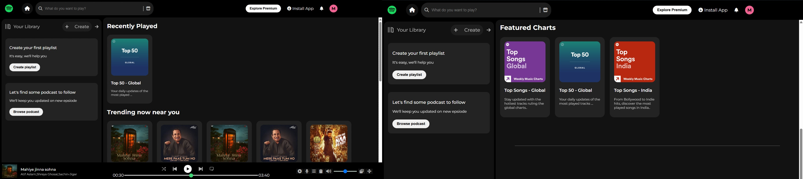

# 🎵 Spotify Clone

A sleek and responsive Spotify web player UI clone, built using **HTML** and **CSS**. This project focuses on replicating the user interface of Spotify’s desktop web player, including features like a sidebar library, music cards, a fixed top navbar, and an animated bottom music player.

## 🔥 Features

- 🎧 Responsive music player layout
- 📚 Sidebar for playlists and podcasts
- 🔍 Search bar and navigation icons
- 💡 Recently played & trending sections
- 🎵 Bottom music control bar
- 💅 Clean, modern UI inspired by Spotify

## 📸 Preview

  
_Merged preview of the Spotify UI clone interface_

## 🛠️ Technologies Used

- **HTML5** – Structure
- **CSS3** – Styling
- **Font Awesome** – Icons
- **Google Fonts** – Typography

## 📌 Note

This is a **frontend-only clone** and does not include actual music playback functionality.

## 🙌 Acknowledgments

- Inspired by [Spotify](https://spotify.com)
- Icons from [Font Awesome](https://fontawesome.com)
- Fonts from [Google Fonts](https://fonts.google.com)

---

Made with ❤️ by [ Adarsh.. ]
